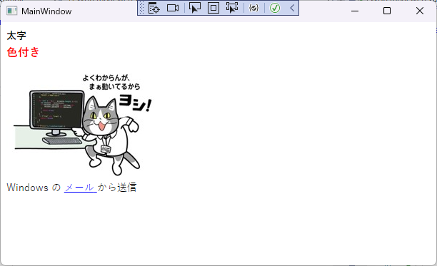

# WpfEmlViewerExample

WPF(.NET 6) にて HTML Mail(.eml) を展開し、WebView にてレンダリングするサンプル実装。

## 参考

- cid 埋め込みイメージ  
  置換頑張る

- WebView2 を解放時に落ちる問題  
  [MicrosoftEdge/WebView2Feedback#1330](https://github.com/MicrosoftEdge/WebView2Feedback/issues/1136#issuecomment-1255470804)
